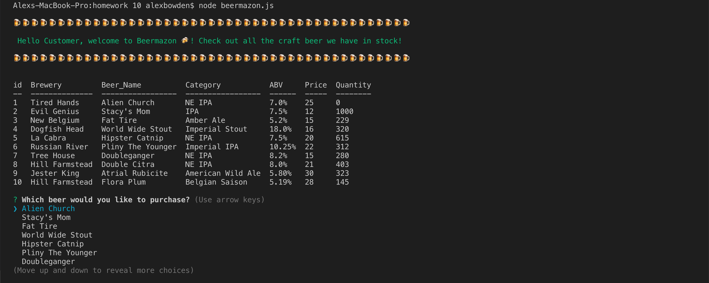

# beermazon

**Creator**: `Alex Bowden`

**Created**: `April 29 2019`

- - -

## ABOUT THE APP
Beermazon is an an Amazon-like storefront made with Node.js and MySQL. The application allows craft beer lovers to buy from an amazing selection of adult beverages. Here's how it works...

- - -
## HOW TO USE BEERMAZON

### **Video Tutorial**

Watch the tutorial video: https://drive.google.com/open?id=1lLDph0KBNuVo99rsRfPybht_nk_FB14r (Turn Volume On)

### **Step by Step instructions**

1. Open your terminal through VS code or bash.
2. Find and open the folder containing the `beermazon.js` file. 
3. Run commands in the terminal under the `beermazon.js` file. 
4. Enter `node beermazon.js` in your terminal to begin te inquirer prompt.

**Opening Prompt**
    
Once the program is run the following screen should appear which begins the program:

## TECHNOLOGIES USED
* Javascript
* Nodejs
* MySQL
* Node packages:
    * MySQL
    * NPM
    * Inquirer
    * Colors
    * Console.Table
    * Node-Emoji

